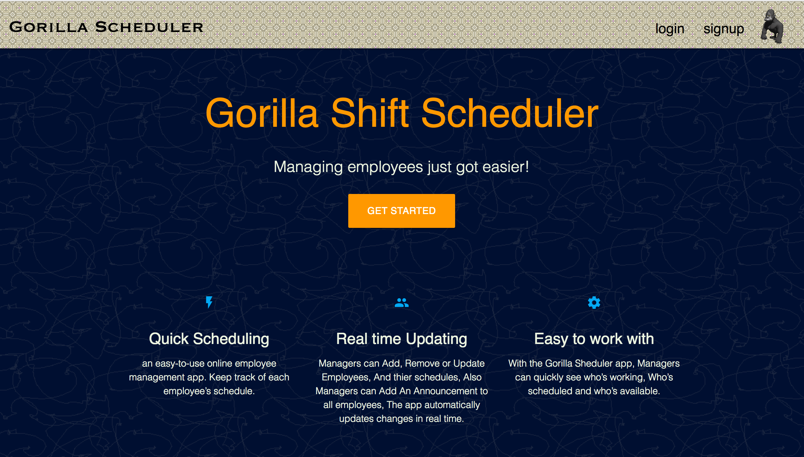
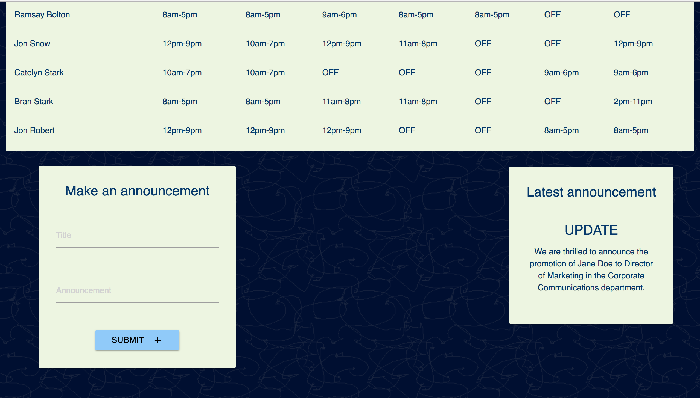
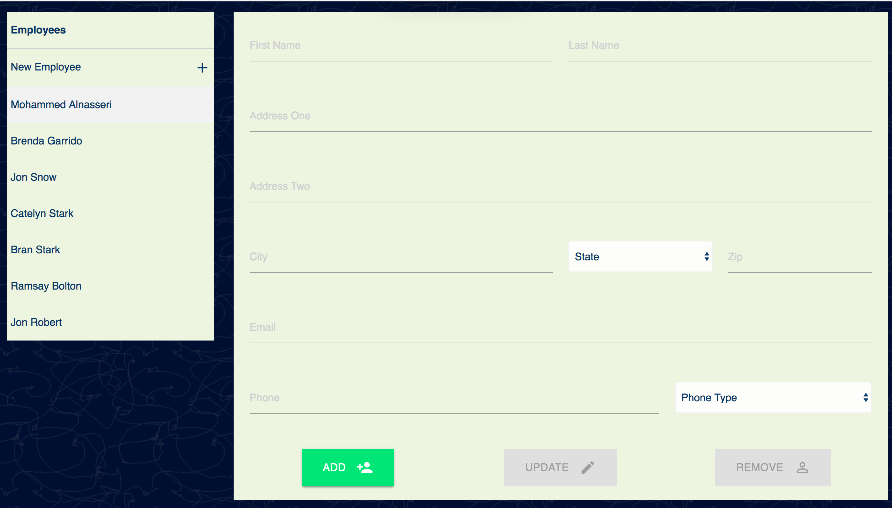

# Gorilla Scheduler
### is an employee management and scheduling app that allows Managers to manage and schedule employees, And Employees to view work schedules Anytime and Anywhere.

### View app live on [Heroku](https://gorilla-shift-scheduler.herokuapp.com/)

## Run locally
### Install dependencies
```shell
npm install
```
### Start the server
```shell
npm run dev
```
### Open a browser and go to [http://localhost:3000](http://localhost:3000)

## Tech
### Built with 

### React, Node, Express, MongoDB, Passport.js.

Important Dependencies Involved In Application Design
---
**Client-Side**

* react - javascript library for creating views/interfaces with components.

* react-router v4 - maps react components to URL routes, thus enabling single-page navigation.

* axios - for making AJAX requests to the server.


**Server-Side**

* express - a node.js http server framework and interface.

* mongoose - mongoDB object modeling tool.

* passportJS
    * passport - express authentication middleware.
    * passport-local - passport strategy for authenticating with an email and password.

* bcrypt-nodejs - for encrypting user passwords before saving them to the database.

## Below Are some screen shots:








